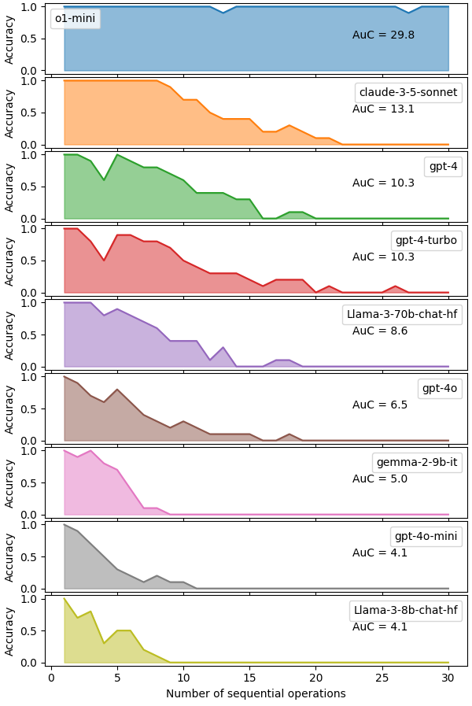

# Testing the Limits of Sequential Processing in Large Language Models

Large Language Models (LLMs) have demonstrated remarkable capabilities in various tasks, ranging from natural language processing to mathematical problem-solving, code generation, and even multimodal understanding. Yet, despite these impressive feats, their reasoning abilities have been repeatedly criticized [[1-6](#references)]. This article presents a novel approach to evaluating the sequential processing and working memory capabilities of LLMs through a simple yet effective minimal experiment. 

Drawing from our experience in developing [agents with Long-Term Memory (LTM)](https://github.com/GoodAI/goodai-ltm-benchmark) and integrating them into [videogames](https://www.aipeoplegame.com/), we have identified notable constraints in LLMs' abilities to sustain and manipulate information over multiple steps—essential for sophisticated reasoning. To systematically evaluate and quantify these limitations, we conducted a study focusing on LLMs' capacity to perform temporally dependent operations. We employed a straightforward yet insightful word substitution task to highlight both the strengths and weaknesses of current LLM architectures in complex information processing tasks, offering valuable insights into their sequential reasoning and working memory capabilities.

Our experiments demonstrate that even with the relatively simple task of word substitutions, most LLMs begin to falter after just two sequential operations, with accuracy dropping sharply as the number of operations increases. This reveals a fundamental weakness in LLMs' ability to handle tasks requiring step-by-step logical thinking, contrasting with their strong performance in other areas. These results have important implications for understanding the limitations of LLMs in sequential reasoning tasks and provide a swift, effective method for assessing an LLM's cognitive-like abilities.


## The Word Swap Challenge: Pushing LLMs to Their Processing Limits

Building on our observations of LLM limitations, we developed the "Word Swap Challenge" to systematically evaluate these constraints. Enter the "Word Swap Challenge" – a deceptively straightforward task that pushes language models to their cognitive limits.

**The task is as follows**: We present an LLM with a list of $N$ ordinary words, in this specific study $N=5$. Then, we challenge it to perform a series of word swaps, each building upon the last. It's like a high-stakes game of verbal Jenga, where one misstep can bring the whole structure tumbling down.

This test isn't just a playful experiment; it's a powerful tool that offers deep insights into an LLM's sequential reasoning capabilities. We've discovered a fascinating correlation: an LLM's performance on this task is a surprisingly accurate predictor of its overall cognitive prowess, at least in the context of our systems. So much so, that we now use it as a litmus test for any new language model before integrating it into our systems.

Here's what makes the **Word Swap Challenge** so compelling:
1. It isolates pure sequential processing, free from the noise of complex language or vast knowledge bases.
2. It reveals how many interconnected steps an LLM can juggle in its *'mental workspace'*.
3. It exposes the delicate balance between an LLM's short-term memory and its ability to apply rules consistently.

As we'll see, even the most advanced LLMs can stumble when the chain of operations grows too long. It's a humbling reminder that beneath their seemingly boundless knowledge, these models still grapple with the fundamentals of logical thinking.

#### Example prompt
```
Here is a list of words:
[rush;night;stone;chain;testing]

Respond with the list of words that results after applying the following operations in order:

1. Switch [rush] for [ghost].
2. Switch [testing] for [population].
3. Switch [ghost] for [rush].
4. Switch [stone] for [ghost].

Respond only with the list of words. Use the same format as in the original list of words.
```

The prompts we craft are short and straightforward, with careful attention to formatting and word choice. Specifically, we ensure that: 
1. the words used are common and familiar; 
2. each word is represented by a single token. 

This approach allows us to focus solely on the model’s sequential reasoning processes, eliminating factors like tokenization artifacts or mid-sentence misunderstandings. For instance, in the example above, the expected final list is `[rush; night; ghost; chain; population]`.

## Results
Our experiments encompass a range of 1 to 30 switch operations, with each configuration tested 10 times to evaluate the consistency of correct responses from each LLM. We deliberately adopt a lenient approach to output formatting to isolate and assess the models' core reasoning capabilities. This flexibility in formatting doesn't affect the performance of more advanced LLMs, though some less sophisticated models occasionally struggle with precise output structure.

To ensure a comprehensive evaluation, we tested a diverse array of LLMs, including various versions of closed-weight models (o-1, GPT-4 Turbo, GPT-4o, and other  variants by OpenAI), Claude Sonnet, as well as other prominent open-weight language models, such as LLaMA 3 8B and Mixtral. This broad selection allows us to draw meaningful comparisons across different model architectures and training approaches.



Surprisingly, this seemingly straightforward task proves to be a formidable challenge for the LLMs. The majority of models begin to err after just 2 operations, and only a handful maintain reasonable accuracy beyond 5 operations. OpenAI's o1-mini emerges as the top performer, followed by Claude 3.5 Sonnet, yet Sonnet still struggles to surpass the 10-operation threshold without errors. Meanwhile, both the older GPT-4 and GPT-4 Turbo models continue to perform robustly, outperforming their newer 4o alternatives.

The results from o1-mini may initially suggest that it outperforms other models in reasoning tasks; however, this interpretation is not accurate. Our word-swap challenge specifically evaluates one-shot responses, whereas Chain-of-Thought (CoT) approaches operate differently by breaking down reasoning into intermediate steps. Consequently, o1-preview’s performance does not necessarily indicate it is categorically more powerful than other models. Moreover, while CoT excels in scenarios that can be clearly articulated through sequential instructions, it faces significant challenges with tasks requiring advanced abstraction and complex logical reasoning. These types of problems often exceed the capabilities of token-based thinking methods, highlighting that no single approach currently dominates across all facets of reasoning in large language models.

A particularly intriguing observation is the pronounced performance dip occurring at the 4-operation mark across 5 of the models tested. A deeper analysis suggests that this dip is linked to an increased rate of word reinstatements, where a word is replaced and then reintroduced into the list. This pattern presents a significant challenge for most models, with the older GPT-4 versions exhibiting the most severe impact.

## Conclusions
These findings highlight a critical vulnerability in current LLMs: their difficulty with prompts that demand sequential thinking. Despite their capacity to handle inputs spanning thousands of tokens, our tests utilize fewer than 340 tokens and a simple word-swap procedure, demonstrating that the challenge lies not in the volume of input but in the complexity of the processing or reasoning required. We believe these insights enhance our understanding of the limitations in LLMs' logical processing and provide a swift method for assessing an LLM’s reasoning abilities. This, in turn, influences its capability to generalize to novel scenarios where it hasn't relied on pre-learned reasoning shortcuts.

Looking ahead, we aim to delve deeper into the impact of compounding errors, such as those previously discussed, by pinpointing specific cases that present unique challenges to LLMs. Additionally, we plan to investigate how varying prompt lengths affect accuracy rates, thereby gaining a more comprehensive view of how prompt size influences logical reasoning performance. Last but not least, we will explore whether standard CoT improves performance of LLMs on the Word Swap Challenge and whether a more advanced CoT approach could approach the performance of the best performing LLM in the study, namely o1-mini, which uses internal reasoning traces to improve performance on tasks that require step-by-step logical reasoning.

You can access the code for these experiments in our [GitHub repository](https://github.com/GoodAI/llm-chained-ops), and view the results through this [link](https://drive.google.com/file/d/1LZEeqkuBjjDaIm-WkQ6fJ6p1LzFeEy66/view?usp=sharing).

## References

[1] Can Large Language Models Reason and Plan?
Kambhampati, S. (2024). Can large language models reason and plan? arXiv preprint arXiv:2403.04121. Retrieved from https://arxiv.org/abs/2403.04121

[2] Reasoning with Language Model Prompting: A Survey
Qiao, S., Ou, Y., Zhang, N., Chen, X., Yao, Y., Deng, S., Tan, C., Huang, F., & Chen, H. (2023). Reasoning with language model prompting: A survey. arXiv preprint arXiv:2212.09597. Retrieved from https://arxiv.org/abs/2212.09597

[3] Reasoning or Reciting? Exploring the Capabilities and Limitations of Language Models Through Counterfactual Tasks
Wu, Z., Qiu, L., Ross, A., Akyürek, E., Chen, B., Wang, B., Kim, N., Andreas, J., & Kim, Y. (2024). In Proceedings of the 2024 Conference of the North American Chapter of the Association for Computational Linguistics: Human Language Technologies (Volume 1: Long Papers), pages 1819–1862. Mexico City, Mexico: Association for Computational Linguistics. doi:[10.18653/v1/2024.naacl-long.102](https://doi.org/10.18653/v1/2024.naacl-long.102)

[4] Inductive or Deductive? Rethinking the Fundamental Reasoning Abilities of LLMs
Wang, Z., Fan, W., Zong, Q., Zhang, H., Choi, S., Fang, T., Liu, X., Song, Y., Wong, G. Y., & See, S. (2024). Inductive or deductive? Rethinking the fundamental reasoning abilities of LLMs. arXiv preprint arXiv:2408.00114. Retrieved from https://arxiv.org/abs/2408.00114

[5] Do Large Language Models Reason Like Us?
Lampinen, A. K., Dasgupta, I., Chan, S. C. Y., Sheahan, H. R., Creswell, A., Kumaran, D., McClelland, J. L., & Hill, F. (2024). Do large language models reason like us? PNAS Nexus, 3(7), page 233. doi:10.1093/pnasnexus/pgae233

[6] Reasoning Abilities of Large Language Models: In-Depth Analysis on the Abstraction and Reasoning Corpus
Huang, J., & Chang, K. C.-C. (2024). Reasoning abilities of large language models: In-depth analysis on the abstraction and reasoning corpus. arXiv preprint arXiv:2403.11793. Retrieved from https://arxiv.org/abs/2403.11793
